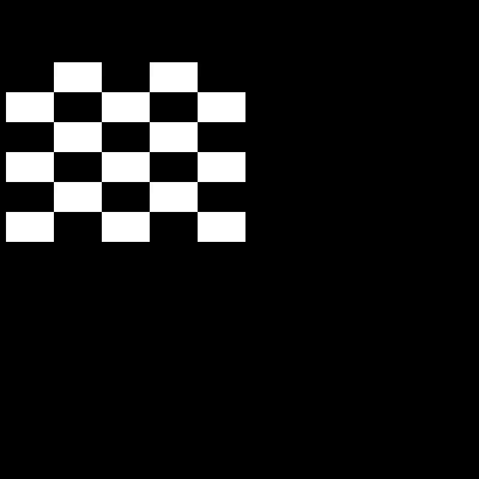

# Summary of the 3D Rendering Assignment

With the provided handout code, turn the triangle into a quad with a checker pattern.

## Mediocre
You turned the triangle into a quad using a single `glDrawArray` or `glDrawElements` call in `TRIANGLE_MODE`.
The checker pattern moves along with the quad through a fragment shader, with the rows and columns set via uniforms.

## Average
The checker pattern rotates and/or scales around the center of the quad, with a keyboard-controllable speed.
There is a lighting effect based on the mouse position.

## Good
There are two moving quads, with the second one having a radial checkerboard pattern instead.
More than 2 things are controlled via uniforms.

## Excellent
The planes are now made up of at least 10x10 vertices.
An index buffer is used with `glDrawElements`.
At least one of the planes waves in the x & y direction.

