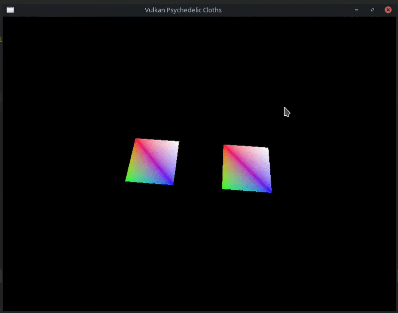
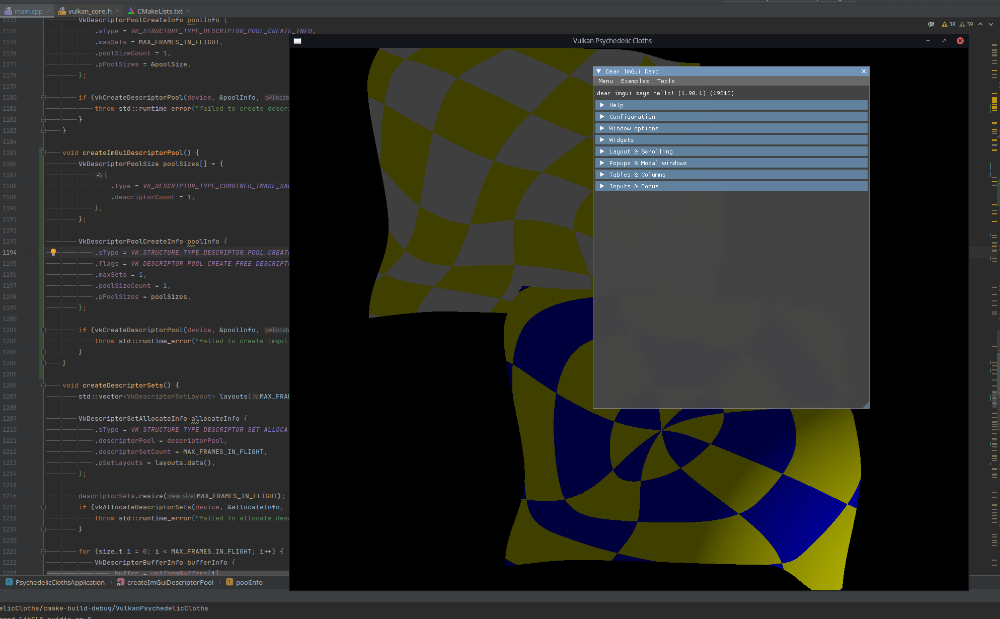

# Vulkan Psychedelic Cloths


A recreation of [my uni's OpenGL assignment](./3D%20Rendering%20Assignment.md) in Vulkan, but also with Dear ImGui.


Dear ImGui:  
[](https://github.com/TechnicJelle/VulkanPsychedelicCloths/raw/feature/dear-imgui/.github/readme_assets/dear-imgui-demo.mp4)  
_( ↑ Click for better quality)_

## Controls
`1`: Switch to default view\
`2`: Switch to wireframe view\
`Mouse`: Shine light on the "cloths"

## Table of Contents
<!-- TOC -->
* [Vulkan Psychedelic Cloths](#vulkan-psychedelic-cloths)
  * [Controls](#controls)
  * [Table of Contents](#table-of-contents)
  * [Building and Running](#building-and-running)
    * [Linux](#linux)
      * [Mint](#mint)
      * [Arch](#arch)
    * [Windows](#windows)
  * [Development Log](#development-log)
    * [CMake Shader Compilation](#cmake-shader-compilation)
    * [Transfer Queue & Bit Masking](#transfer-queue--bit-masking)
    * [Close on Escape](#close-on-escape)
    * [Uniform Buffers: Descriptor Pool and Sets](#uniform-buffers-descriptor-pool-and-sets)
    * [Wireframe rendering](#wireframe-rendering)
    * [Assignment Excellent](#assignment-excellent)
    * [Preparation for adding Dear ImGui](#preparation-for-adding-dear-imgui)
    * [Running some demos and playing around with them](#running-some-demos-and-playing-around-with-them)
    * [Including and linking into my project](#including-and-linking-into-my-project)
    * [Init and cleanup](#init-and-cleanup)
    * [Getting the demo window to show up](#getting-the-demo-window-to-show-up)
    * [Splitting up](#splitting-up)
    * [Adding pipeline dropdown](#adding-pipeline-dropdown)
    * [Styling](#styling)
    * [Viewports](#viewports)
  * [Time Spent](#time-spent)
<!-- TOC -->

## Building and Running
Instructions on how to build this project.

### Linux
#### Mint
(Debian and Ubuntu should be similar)
```bash
sudo apt update && sudo apt upgrade
sudo apt install git cmake g++ vulkan-tools libvulkan-dev vulkan-validationlayers-dev spirv-tools glslang-tools libglm-dev libglfw3-dev
git clone https://github.com/TechnicJelle/VulkanPsychedelicCloths.git --recursive
cd VulkanPsychedelicCloths
cmake -S . -B build
cmake --build build
cd build/
./VulkanPsychedelicCloths
```

#### Arch
(Other Arch-based distros should be similar)
```bash
sudo pacman -Syyuu
sudo pacman -S git cmake gcc make vulkan-devel glm glfw
git clone https://github.com/TechnicJelle/VulkanPsychedelicCloths.git --recursive
cd VulkanPsychedelicCloths
cmake -S . -B build
cmake --build build
cd build/
./VulkanPsychedelicCloths
```

### Windows
Try following this: https://vulkan-tutorial.com/Development_environment#page_Windows

## Development Log
A few "blog posts" about certain notable parts of the development.

I began by following the Vulkan Tutorial book (https://vulkan-tutorial.com/), but after finishing the chapter **Uniform Buffers**,
I had acquired the knowledge required to start going my own way; to start implementing the assignment requirements. 

### CMake Shader Compilation
During the chapter **Graphics Pipeline Basics: Shader Modules**, I went on a tangent regarding the compilation of the shaders,
which in the book is simply done with a script that you have to run every time you change something in the shader.\
I took the time to put the shader compilation into my CMake build setup, so every time the program itself gets built, it'll also build the shaders.
So there's no need for an external script somewhere anymore, because it's now fully integrated in the building of the program itself.\
It took a lot of time and effort, because CMake is quite a pain to work with, but in the end, I did do it, and I'm quite pleased with myself about it.

### Transfer Queue & Bit Masking
In the chapter **Vertex Buffers: Staging Buffer**, an optional challenge is given in the *Transfer Queue* paragraph. I usually skipped those, but this one felt doable, so I tried it.\
I managed to almost do it, but I got an error: "bad optional access", which I managed to track down to a single if-statement:
```cpp
if (queueFamily.queueFlags & !VK_QUEUE_GRAPHICS_BIT & VK_QUEUE_TRANSFER_BIT)
```
What happens here is part of a concept called "bit-masking", which I mostly do understand, but I have hardly any experience with it, so I had to ask for help on how to actually exactly do it.\
The code you see there is wrong, and this is the right code:
```cpp
if ((queueFamily.queueFlags & VK_QUEUE_TRANSFER_BIT) && !(queueFamily.queueFlags & VK_QUEUE_GRAPHICS_BIT))
```
I thought it was possible to combine bit masks like that, but it turns out that that is not the way it's done. You just do two checks.

After this, it still wouldn't work, which was due to a dumb mistake I had made somewhere else:
```cpp
struct QueueFamilyIndices {
	std::optional<uint32_t> graphicsFamily;
	std::optional<uint32_t> presentFamily;
	std::optional<uint32_t> transferFamily;
	
	bool isComplete() const {
		return graphicsFamily.has_value() && presentFamily.has_value();
	}
};
```
Can you spot it?

Exactly, I had simply forgotten to also include `transferFamily.has_value()`...\
After I included that, everything worked like it should! And I could continue working on the rest of the chapter, which then went without further troubles.

### Close on Escape
For little graphics programs like these, I'm used to being able to press `Esc` on my keyboard to close it. So I don't have to click the tiny X button.\
I took a little detour to refresh my knowledge of handling key presses with GLFW, which is the library I'm using to handle the creation of the window itself.\
It also handles the actual inputs, like the mouse, keyboard and even gamepads.
```cpp
void initWindow() {
	window = glfwCreateWindow(WIDTH, HEIGHT, "Vulkan Psychedelic Cloths", nullptr, nullptr);
	glfwSetKeyCallback(window, keyCallback);
}

static void keyCallback(GLFWwindow* window, int key, int scanCode, int action, int modifierKeys) {
	if (key == GLFW_KEY_ESCAPE && action == GLFW_PRESS) {
		glfwSetWindowShouldClose(window, GLFW_TRUE);
	}
}
```
This ended up being all that's necessary.\
Just a simple custom handler function that I pass into GLFW to call whenever a key is pressed.

### Uniform Buffers: Descriptor Pool and Sets
After following that chapter from the book, I tried to run my program, but it kept logging an error to the console, meaning I had gone wrong somewhere.\
I could look at the answer code from the book, but I decided to try and debug it myself.\
Due to the validation layers Vulkan offers, it logged a very detailed error message about what went wrong, and where:
```
Validation Error: [ VUID-vkCmdDrawIndexed-None-02699 ] Object 0: handle = 0x301e6c0000000022, type = VK_OBJECT_TYPE_DESCRIPTOR_SET; | MessageID = 0xa44449d4
	Descriptor set VkDescriptorSet 0x301e6c0000000022[] encountered the following validation error at vkCmdDrawIndexed time:
	Descriptor in binding #0 index 0 is being used in draw but has never been updated via vkUpdateDescriptorSets() or a similar call.
	The Vulkan spec states: Descriptors in each bound descriptor set, specified via vkCmdBindDescriptorSets,
	must be valid as described by descriptor validity if they are statically used by the VkPipeline bound to the pipeline bind point used by this command
	(https://www.khronos.org/registry/vulkan/specs/1.3-khr-extensions/html/vkspec.html#VUID-vkCmdDrawIndexed-None-02699)
```
So I followed that log to where it pointed me to, which was the loop in which I update the Descriptor Sets[^1] for each frame currently in flight[^2].
```cpp
for (size_t i = 0; i < MAX_FRAMES_IN_FLIGHT; i++) {
	VkDescriptorBufferInfo bufferInfo {
		.buffer = uniformBuffers[i],
		.offset = 0,
		.range = sizeof(UniformBufferObject),
	};
	
	VkWriteDescriptorSet descriptorWrite {
		.sType = VK_STRUCTURE_TYPE_WRITE_DESCRIPTOR_SET,
		.dstSet = descriptorSets[i],
		.dstBinding = 0,
		.dstArrayElement = 0,
		.descriptorCount = 1, // <-- I had forgotten this line
		.descriptorType = VK_DESCRIPTOR_TYPE_UNIFORM_BUFFER,
		.pBufferInfo = &bufferInfo,
	};
	
	vkUpdateDescriptorSets(device, 1, &descriptorWrite, 0, nullptr);
}
```
Luckily, it ended up just being a single part of the Write Descriptor Set object that I had forgotten.

[^1]: A Descriptor Set is a part of the Vulkan concept of Resource Descriptors, which are the way to send data to shaders that is _not_ different for each vertex, but the same everywhere.
[^2]: A Frame in Flight means a frame that is currently in the process of being rendered. In graphical applications, it is often good to have at least two frames in flight at any given time:
one that is being displayed on the screen, and another that is currently being drawn to. Then those can be swapped around when it's time for the screen to display the next frame.

### Wireframe rendering


To make the planes warp and wobble around, it needs to have more than just the four vertices at each corner. It needs to have a whole bunch of vertices, which can then all be separately displaced.\
Such a plane can be generated with code, and for the 3D Rendering course I had already written a function for that.\
To debug it, though, I used the wireframe rendering feature of OpenGL.\
I went looking for a way to modify Vulkan's Render Pipeline, to toggle that option on and off. I found the option, but it's only possible to be set when the Pipeline is created.
Not after that, while the program is running. Vulkan's Render Pipeline is basically completely immutable, to encourage creating everything beforehand, and caching as much as possible.
(Source: https://computergraphics.stackexchange.com/questions/4499/how-to-change-sampler-pipeline-states-at-runtime-in-vulkan )\
So I went to search for a way to have multiple pipelines. Which I found, in the form of a GitHub repo full of examples of different Vulkan concepts.\
Specifically, this example: https://github.com/SaschaWillems/Vulkan/blob/master/examples/pipelines/pipelines.cpp \
This helped me understand how to use multiple pipelines, after which it was rather simple to create and store the multiple pipelines, and to switch between them on a button press.

The button presses are handled by GLFW, of course, so I had to expand the key callback function I described earlier to this:
```cpp
static void keyCallback(GLFWwindow* window, int key, int scanCode, int action, int modifierKeys) {
	PsychedelicClothsApplication* app = (PsychedelicClothsApplication*) (glfwGetWindowUserPointer(window));
	if (action != GLFW_PRESS) return;
	switch (key) {
		case GLFW_KEY_ESCAPE:
			glfwSetWindowShouldClose(window, GLFW_TRUE);
			break;
		case GLFW_KEY_1:
			app->currentPipeline = DEFAULT;
			break;
		case GLFW_KEY_2:
			app->currentPipeline = WIREFRAME;
			break;
		default:
			break;
	}
}
```
That first line of this function may look a little strange, so I'll explain it in a bit more detail:\
Due to the fact that the callback function is `static`, it can't access the `PsychedelicClothsApplication` class' member variables, so we need to get a pointer to it somehow.\
Luckily, GLFW allows us to store any pointer inside the window object, which we can then retrieve in the static context,
and convert back into a `PsychedelicClothsApplication*` type, so we can actually access and modify the class' member variables.\
I learnt this trick earlier while going through the book, here: https://vulkan-tutorial.com/Drawing_a_triangle/Swap_chain_recreation#page_Handling-resizes-explicitly , where it is used in the window resize callback.

### Assignment Excellent
For the other parts of the assignment, it was mostly enough to simply copy the shader code from my OpenGL assignment.\
Though for the excellent, that did not end up being enough.\
For some reason, the waving "cloth" did not wave properly. It seems to at first, but it did strange jumps and hops, which the OpenGL version most certainly did not do.


After about an hour or two of futile debugging of my own, I started looking up if Vulkan maybe had some extra debugging features I could use.\
Debugging shaders is always terribly difficult, because you can't just print out the values that it's calculating.\
But! Apparently there is a Vulkan extension that allows one to do just that!\
I looked into how to use it, and it seemed simple enough at first.\
But I never succeeded in getting it to output anything...\
I'm still not sure why, and I should look into this more sometime in the future, because this would be an insanely useful thing to have in my "tool belt".\
After another couple of hours, I thought to try to apply the noise calculations to the fragment shader, instead of the vertex shader, just to be able to see what it's doing a little better.\
And there it was. Very clear. Something was _definitely_ wrong with the noise function. The noise was not smooth in all places! It had some really nasty lines and seams in it.\
So I went looking for other noise functions, and I found many, one of which by the same author of the one I had been using already.\
I tried other ones first, but in the end, I decided to try that other one by that same author.\
The code was extremely similar, with the only real difference being in the hashing function that was used.\
Hashing functions are an integral part of pseudo-random number generator functions that take a number and give back another number. That output number is a very garbled result of the input.\
The real magic is when the input changes only a tiny bit, the output number changes drastically.\
The reason this is necessary, is because shaders don't have a nice built-in random number generator, so shader programmers have to supply their own. For most applications a simple calculation is good enough.
```glsl
float hash_old(vec2 st) {
	return fract(sin(dot(st.xy, vec2(12.9898,78.233))) * 43758.5453123);
}

float hash_new(vec2 p) {
	vec3 p3 = fract(vec3(p.xyx) * 0.13);
	p3 += dot(p3, p3.yzx + 3.333);
	return fract((p3.x + p3.y) * p3.z);
}
```


Using that new hashing function, the problem was gone! I am still so confused as to why that old hashing function works just fine in the OpenGL version, though.\
Now that the "cloths" were waving nice and smoothly, that officially meant I had finished the project! 🎉

### Preparation for adding Dear ImGui
I now want to learn how Dear ImGui works, so I'll be working on adding it to this project.

I watched some YouTube videos to get a bit of an overview:
- https://www.youtube.com/watch?v=5zS-DZhCA2g
- https://www.youtube.com/watch?v=-NJDxf4XwlQ
- https://www.youtube.com/watch?v=st4lgNI6_F4
- https://www.youtube.com/watch?v=dttr3OGVewQ
- https://www.youtube.com/watch?v=EXgXMa5kapI
- https://www.youtube.com/watch?v=bUUZ1iD9_e4
- https://www.youtube.com/watch?v=vWXrFetSH8w
- https://www.youtube.com/watch?v=lZuje-3iyVE
- https://www.youtube.com/watch?v=yBP1gSbQPPM
- https://www.youtube.com/watch?v=Du--cH01ZWI
- https://www.youtube.com/watch?v=nVaQuNXueFw

After that, I read the official examples and documentation
- https://github.com/ocornut/imgui/blob/master/docs/FAQ.md
- https://github.com/ocornut/imgui/wiki/Getting-Started
- https://github.com/ocornut/imgui/blob/master/docs/EXAMPLES.md

### Running some demos and playing around with them
Aside from the desktop GLFW+Vulkan implementation of Dear ImGui, I also tried out the Android+OpenGL3 version on my phone.  
It worked seamlessly after only a little bit of fiddling with the build!  
It's really cool to see Dear ImGui working just as well on my phone as it does on my computer!

I'm going to be following the Getting Started guide.

### Including and linking into my project
To start, I need to include Dear ImGui into my project, so I added the repo as a git submodule, and copied this:

```cmake
set(IMGUI_DIR ../../)
include_directories(${IMGUI_DIR} ${IMGUI_DIR}/backends ..)
```

from the [example CMake file](https://github.com/ocornut/imgui/blob/f50ddc431e3b8840036e88abc4c3cf74500aa12b/examples/example_glfw_vulkan/CMakeLists.txt#L27-L29).

This didn't immediately work of course, so I had to adapt it a bit, which ended up becoming this:

```cmake
set(IMGUI_DIR ${CMAKE_CURRENT_SOURCE_DIR}/deps/imgui)
include_directories(${IMGUI_DIR})
include_directories(${IMGUI_DIR}/backends)
```

After that, I was able to `#include` headers into my `main.cpp` file:

```cpp
#include "imgui.h"
#include "imgui_impl_glfw.h"
#include "imgui_impl_vulkan.h"
```

However, when actually typing any Dear ImGui code and trying to run it, it breaks.

After inspecting the example even further, I found out that, while I was including the header files, I wasn't compiling
and linking the accompanying cpp files.  
So I had to add those, too:

```cmake
add_executable(
	${PROJECT_NAME}
	src/main.cpp
	${IMGUI_DIR}/imgui.cpp
	${IMGUI_DIR}/imgui_draw.cpp
	${IMGUI_DIR}/imgui_demo.cpp
	${IMGUI_DIR}/imgui_tables.cpp
	${IMGUI_DIR}/imgui_widgets.cpp
	${IMGUI_DIR}/backends/imgui_impl_glfw.cpp
	${IMGUI_DIR}/backends/imgui_impl_vulkan.cpp
	${VERT_OUT}
	${FRAG_OUT}
)
```

Finally, it was running again!

### Init and cleanup
Now I have to initialise ImGui, and as I'm using Vulkan, it's a bit more involved than if I were using OpenGL, for example.
I need to pass a bunch of information into the init function.
Most of it are already normal member variables of my game class, but some of them are only variables that were used
once, locally, in some other function, so I have to make those member variables, too.
I'm taking heavy inspiration from their [GLFW+Vulkan](https://github.com/ocornut/imgui/blob/f50ddc431e3b8840036e88abc4c3cf74500aa12b/examples/example_glfw_vulkan/main.cpp#L427-L443) example, too.

After successful initialisation, it also needs to be deinitialised/cleaned up.

Luckily, that ended up being really easy.
So now Dear ImGui is properly being initialised and cleaned up.
This is where I'll stop for today.

Here's exactly what I did today:
https://github.com/TechnicJelle/VulkanPsychedelicCloths/commit/907fe1c45102c3d9d028ec65ab0d31c46d09fc3c

### Getting the demo window to show up
It's a new day today, and I'm full of new energy to continue tackling this task!
I'm continuing where I left off yesterday, by trying to now get ImGui to draw to my window.
However, when I do what the example project does, I get this error:

```diff
- Validation Error: [ VUID-VkDescriptorSetAllocateInfo-apiVersion-07895 ] Object 0: handle = 0x3a6cbb0000000025, type = VK_OBJECT_TYPE_DESCRIPTOR_POOL; | MessageID = 0xc4bdd9fe | vkAllocateDescriptorSets():
- Unable to allocate 1 descriptorSets from VkDescriptorPool 0x3a6cbb0000000025[]. This pool only has 0 descriptorSets remaining.
- The Vulkan spec states: If the VK_KHR_maintenance1 extension is not enabled, VkPhysicalDeviceProperties::apiVersion is less than Vulkan 1.1,
- descriptorSetCount must not be greater than the number of sets that are currently available for allocation in descriptorPool
- (https://www.khronos.org/registry/vulkan/specs/1.3-extensions/html/vkspec.html#VUID-VkDescriptorSetAllocateInfo-apiVersion-07895)
```

After a bit of googling, I found a GitHub issue of someone in the same situation as I am:
https://github.com/ocornut/imgui/issues/5085
They managed to fix their problem, so I am confident that I will also be able to!
They also posted the solution they found, and even the whole source code of their project!
Of course, I cloned it to have a closer look at how they do things, and I'm learning a lot from it!
I need to create new variables and fill them up with the proper Vulkan data for Dear ImGui to use.

After a while of studying this new repo, I wanted to try to run it, but sadly it crashes every single time I try to
start it up. I tried to fix it for a while, but I couldn't make sense of it...

I got to work on implementing the required things that I now learnt about that the example didn't mention. The example
takes a few shortcuts I can't take with my program.
And yes, I got it! The demo window of Dear ImGui is finally visible!!


I took some more time to clean this up a bit, and then I committed my work:
https://github.com/TechnicJelle/VulkanPsychedelicCloths/commit/33c708899bbcd908cfd414699f85dc2fc5334394

I also planned out some more steps to take to make this implementation even better. I'll do those after dinner, though.

### Splitting up
I just noticed that I am still drawing Dear ImGui to the main command buffer, instead of the one I specifically made for
Dear ImGui. When I try to set it to use its own one, though, it disappears from my screen. This means I will have to
prioritise making a new pipeline specifically for Dear ImGui, before I do anything else.
I am going to try and see if I can reuse some code I already have for recording command buffers and stuff like that.

After hours of typing, I finally fixed it again!
https://github.com/TechnicJelle/VulkanPsychedelicCloths/commit/5dca9b90d12f1f772b5305efebb9d6c4b2fdd5ad

### Adding pipeline dropdown
I have finally set up Dear ImGui enough that I can start making my own debug UI panels!
To start with something simple, I decided to make a dropdown for the current render pipeline.
Because in this program, you can switch between normal mode, and wireframe mode, by typing `1` and `2` on your keyboard.
Adding a dropdown for this should be easy enough...

Of course, I started by googling how to make a dropdown in Dear ImGui, but I found surprisingly little information(!)\
Until I scrolled to this post on HackerNews: https://news.ycombinator.com/item?id=28169906
> **elpocko** on _Aug 13, 2021_ | on: _Egui: An easy-to-use immediate mode GUI_  
> Why does every IM UI library have a dropdown widget that they call "Combo box"? Dear ImGui, Nuklear, this one does it
too.  
> A dropdown list is not a combo box - a combo box is a text input box combined with a dropdown list. This "combo"
aspect is missing in all these frameworks, but they still call their simple dropdowns "Combo box".

Even though this isn't a post about Dear ImGui, but another immediate mode UI library, this told me that the term I'm
used to, "dropdown", isn't what I should be looking for.  
And indeed, when I looked for "Dear ImGui ComboBox" instead, I found what I was looking for: a nice example to learn from:
https://github.com/ocornut/imgui/issues/1658  
Now I just need to adapt this example to my own situation.

With some funky C++ code, I was finally able to loop over the enum that keeps track of which pipeline is being used, to
add dropdown labels for all the options. And by comparing the strings, I am able to detect which option is clicked, and
then I set the pipeline to the selected option.
https://github.com/TechnicJelle/VulkanPsychedelicCloths/commit/1e8e66e90fb3bec55be8d59080ace76952877c61

### Styling
Up till now, I have only used the default options of Dear ImGui, but by setting a few flags, I should be able to enable some extra features!  
Like keyboard inputs, so you can navigate through the menus with only your keyboard, instead of with the mouse.  
And the special docking branch, which allows you to drag panels out of the main window!

So I started with enabling these flags:

```cpp
ImGuiIO& io = ImGui::GetIO();
io.ConfigFlags |= ImGuiConfigFlags_NavEnableKeyboard; // Enable Keyboard Controls
io.ConfigFlags |= ImGuiConfigFlags_NavEnableGamepad; // Enable Gamepad Controls
io.ConfigFlags |= ImGuiConfigFlags_DockingEnable; // Enable Panels to be Docked to Eachother
```

This worked great!
https://github.com/TechnicJelle/VulkanPsychedelicCloths/commit/1252a57937c9f13fb7cad48383bc051fe8f92331

### Viewports
However, when I tried to add this:

```cpp
io.ConfigFlags |= ImGuiConfigFlags_ViewportsEnable; // Allow Panels to be Dragged Out of the Main Window

/* ... */

// Update and Render additional Platform Windows
if (const ImGuiIO& io = ImGui::GetIO(); io.ConfigFlags & ImGuiConfigFlags_ViewportsEnable) {
	ImGui::UpdatePlatformWindows();
	ImGui::RenderPlatformWindowsDefault();
}
```

Vulkan started erroring like crazy:

```diff
- Validation Error: [ VUID-vkCmdDrawIndexed-renderPass-02684 ] Object 0: handle = 0x74d977000000004a, type = VK_OBJECT_TYPE_RENDER_PASS; Object 1: handle = 0xcfef35000000000a, type = VK_OBJECT_TYPE_RENDER_PASS; | MessageID = 0x8cb637c2 | vkCmdDrawIndexed():
- RenderPasses incompatible between active render pass w/ VkRenderPass 0x74d977000000004a[] and pipeline state object w/ VkRenderPass 0xcfef35000000000a[] Attachment 0 is not compatible with 0: They have different formats..
- The Vulkan spec states: The current render pass must be compatible with the renderPass member of the VkGraphicsPipelineCreateInfo structure specified when creating the VkPipeline bound to VK_PIPELINE_BIND_POINT_GRAPHICS 
- (https://www.khronos.org/registry/vulkan/specs/1.3-extensions/html/vkspec.html#VUID-vkCmdDrawIndexed-renderPass-02684)
```

Time to debug!

Of course, I started by googling the error, and I found someone with the same issue!
Even specifically also using Dear ImGui! https://github.com/ocornut/imgui/issues/3522

This is a very tricky issue, even though it's so well-documented. It has to do with the Pipeline that Dear ImGui uses,
which works for the normal situation of rendering in the same window, but it does not work on other windows.  
The underlying problem is that I request a surface format of type `VK_FORMAT_B8G8R8A8_SRGB` from Vulkan to draw my stuff
on, but Dear ImGui's separate windows only work on any of these:  
`{ VK_FORMAT_B8G8R8A8_UNORM, VK_FORMAT_R8G8B8A8_UNORM, VK_FORMAT_B8G8R8_UNORM, VK_FORMAT_R8G8B8_UNORM };`.  
I use the SRGB format, because it is the best one for visual applications, according to the
[Vulkan Tutorial](https://vulkan-tutorial.com/Drawing_a_triangle/Presentation/Swap_chain#page_Surface-format).  
I am currently diving through Dear ImGui's source code to figure out the best way for me to proceed. with this...

After even more time of looking into how and why it works in the example project, I finally discovered a discrepancy.
In the version of Dear ImGui I am currently using
([v1.90.1-docking](https://github.com/ocornut/imgui/releases/tag/v1.90.1-docking))
there is this line of code in the Dear ImGui source code:

```cpp
// We do not create a pipeline by default as this is also used by examples' main.cpp,
// but secondary viewport in multi-viewport mode may want to create one with:
//ImGui_ImplVulkan_CreatePipeline(device, allocator, VK_NULL_HANDLE, wd->RenderPass, VK_SAMPLE_COUNT_1_BIT, &wd->Pipeline, bd->Subpass);
```

This line of _commented out_, here.
However!

When I look at the example project that I have cloned, which is not using that same version
(because I forgot to switch back to that previous version on this clone), that line of code looks like this:

```cpp
ImGui_ImplVulkan_CreatePipeline(v->Device, v->Allocator, v->PipelineCache, bd->RenderPass, v->MSAASamples, &bd->Pipeline, bd->Subpass);
```

As you can see, _it is not commented out!_

I have a very sneaking suspicion that updating the version of Dear ImGui I am using in my own project will fix this.
I'm about to find out, and I _will_ curse very loudly if it does.

...It did not fix the issue.  
Honestly, I'm not sure if I'm happier with this result than if it had worked.
If it had worked, I'd be mad because fixing it was as easy as updating.
Not now that it doesn't work, I'm _also_ mad that it still doesn't work!
There's no winning with this...

I must still be doing something wrong somewhere, but I just can't see where!

...

Aha. I have been fooled. The example _does_ also have the same issue! It's just hidden, because debug mode wasn't
properly on!
Damn it.

After even more headaches, I realised I have been a bit dumb.
Earlier, I mentioned that the new version has the line uncommented. It does not. I was looking at a different use of the
same function.
It is still commented out, even on the most recent commit.

When I uncomment it, it works great.
I found an open issue from about half a year ago on GitHub that asks about why it's still commented.
I've added my findings to it in a comment: https://github.com/ocornut/imgui/issues/6515#issuecomment-1930917091

It is now very late and I have basically achieved what I wanted, anyway, so I'll be leaving this project here.

## Time Spent
An activity prefixed with a "📖" means that that time was spent following a chapter of the book.

| Activity                                           | Hours |
|----------------------------------------------------|-------|
| Researching if I should learn Vulkan, and how      | 7     |
| 📖 Introduction, Overview, Development environment | 1     |
| 📖 Setup: Base code                                | 0.5   |
| 📖 Setup: Instance                                 | 1     |
| 📖 Setup: Validation Layers                        | 2     |
| 📖 Setup: Physical Devices and Queue Families      | 1.5   |
| 📖 Setup: Logical Device and Queues                | 1     |
| 📖 Presentation: Window Surface                    | 1     |
| 📖 Presentation: Swap Chain                        | 3     |
| 📖 Presentation: Image Views                       | 0.5   |
| 📖 Graphics Pipeline Basics: Introduction          | 0.5   |
| 📖 Graphics Pipeline Basics: Shader Modules        | 4     |
| 📖 Graphics Pipeline Basics: Fixed Functions       | 2     |
| 📖 Graphics Pipeline Basics: Render Passes         | 1     |
| 📖 Drawing: Framebuffers                           | 0.5   |
| 📖 Drawing: Command Buffers                        | 2     |
| 📖 Drawing: Rendering and Presentation             | 2     |
| 📖 Drawing: Frames in Flight                       | 1     |
| Close the program when you press Escape            | 0.5   |
| 📖 Drawing: Swap Chain Recreation                  | 2     |
| 📖 Vertex Buffers: Input Description               | 1     |
| 📖 Vertex Buffers: Buffer Creation                 | 3     |
| 📖 Vertex Buffers: Staging Buffer + Transfer Queue | 4     |
| 📖 Vertex Buffers: Index Buffer                    | 3     |
| 📖 Uniform Buffers: Descriptor Layout and Buffer   | 2     |
| 📖 Uniform Buffers: Descriptor Pool and Sets       | 3     |
| Two squares!                                       | 0.5   |
| Researching wireframe rendering                    | 3     |
| Implementing wireframe rendering                   | 2     |
| Experimenting with & implementing pipeline cache   | 4     |
| Procedural plane generation                        | 4     |
| Assignment **Average**                             | 4     |
| Assignment **Good**                                | 1     |
| Assignment **Excellent**                           | 5     |
| Writing the README.md                              | 5     |
| Writing the report                                 | 5     |
| **Total**                                          | 83.5  |

| Dear ImGui Activity                             | Hours |
|-------------------------------------------------|-------|
| Watching YouTube tutorials                      | 5     |
| Reading examples                                | 2     |
| Reading documentation                           | 3     |
| Running some demos and playing around with them | 2     |
| Including and linking into my project           | 3     |
| Init and Cleanup                                | 3     |
| Getting the demo window to show up              | 7     |
| Splitting up                                    | 6     |
| Adding pipeline switcher dropdown               | 5     |
| Styling                                         | 2     |
| Viewports                                       | 10    |
| **Total**                                       | 48    |
